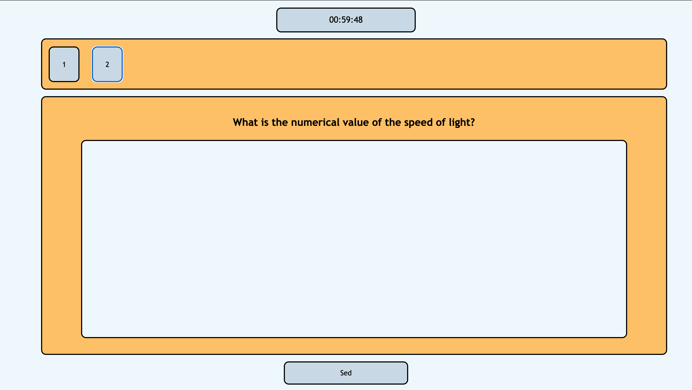

# Testing system

## Installation
In order to install the system, first install Node.js. Then, just clone (or download) the repository. Locate the repository in your terminal and type `node server`. Then the server will start running on port `12345`. That is, the system can now be reached by typing in `localhost:12345` into the browser. 

### Initial data
The login page can be found in `localhost:12345` url. Also, the page for students is located in `localhost:12345/testavimas`. Currently, there is only one user in the system: username: `admin`, password: ` ` (there is no password).

### Features
A teacher can:
1. Create a test.
2. Create questions in the test: open-ended, multiple-choice and one-choice.
3. Distribute the code of the test for students.
4. Check the results of the test.
5. Manually alter the results of the test.

A student can:
1. Enter the code of the test into the system.
2. Solve the test in the given period of time.

### Screenshots

